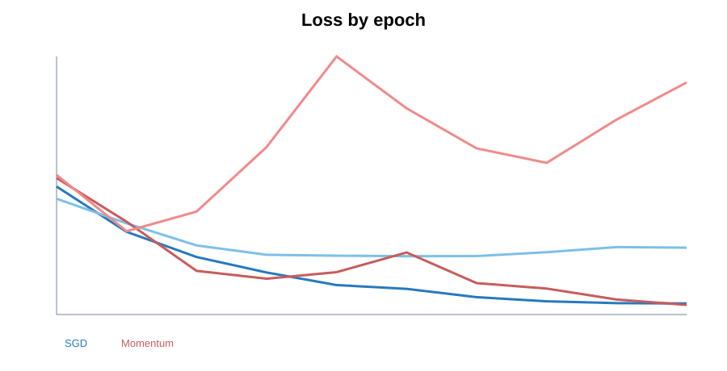
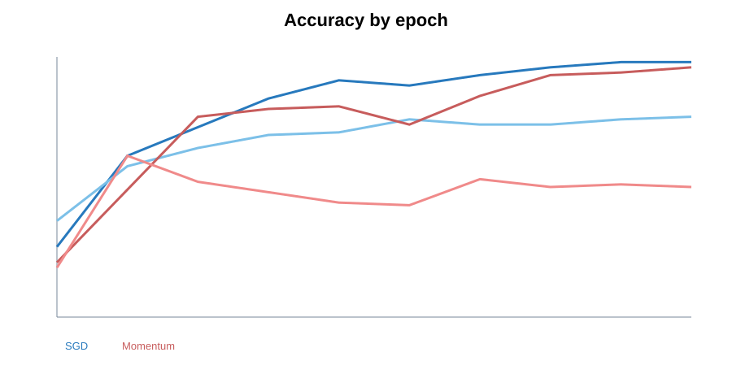
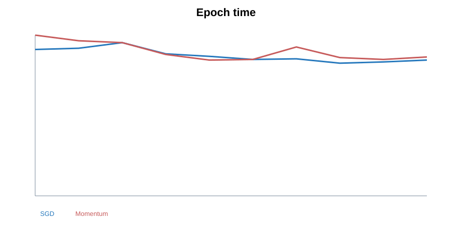
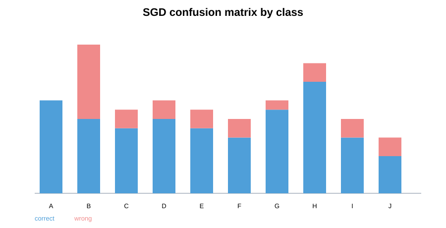
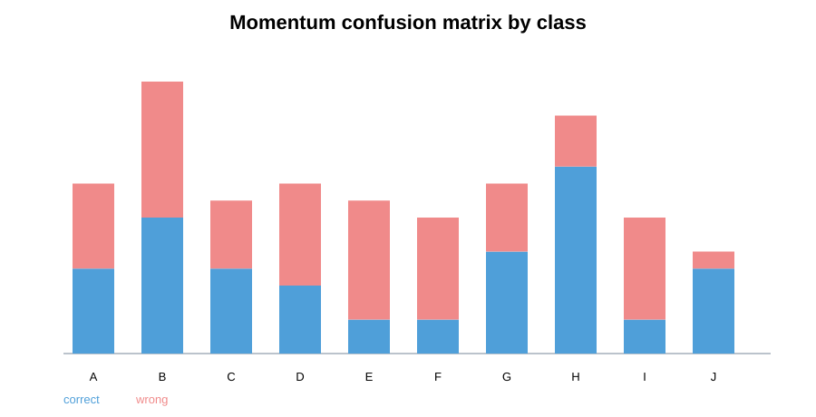

# Классификация символов A-J на C

## О проекте

Это учебный проект по реализации сверточной нейронной сети на языке C. Сеть обучается распознавать буквы из датасета notMNIST: классы идут от `A` до `J`, всего 10 классов.

Архитектура сети сейчас такая:
```text 
input image 28x28x1 -> convolution -> ReLU -> MaxPool -> Flatten -> Linear layer -> Softmax -> probabilities for A-J
```

В проекте сравниваются два варианта обучения:
- обычный градиентный спуск `SGD`;
- `SGD + Momentum`.

После обучения сохраняются логи, матрицы распознавания классов и графики.

## Как собрать и запустить

Проект собирается через `Makefile`.
Запуск обучения: make run
При возниконвенни ошибок в создании визуализаций ввести: 
`mkdir results
mkdir visualizations\out`

После запуска программа:
1. читает конфиг из `configs/config.txt`;
2. загружает `data/train.csv` и `data/test.csv`;
3. обучает модель на обычном SGD;
4. обучает модель на SGD с Momentum;
5. сохраняет историю обучения;
6. сохраняет confusion matrix;
7. сохраняет веса моделей;
8. строит svg-графики в папку `visualizations/out`.

## Структура проекта

```text
project_nero/
├── c/                         # основные .c файлы
├── include/                   # заголовочные .h файлы
├── configs/
│   └── config.txt             # параметры сети и обучения
├── data/
│   ├── train.csv              # train dataset
│   └── test.csv               # test dataset
├── results/                   # csv-логи, confusion matrix, сохраненные веса
├── visualizations/            # сохранение весов и графиков
├── Makefile                   # сборка проекта
└── README.md
```

## Конфиг

Файл `configs/config.txt` задает основные параметры проекта.
Сейчас там используются такие группы параметров:
- `input_w`, `input_h`, `input_ch` - размер входного изображения;
- `classes` - количество классов;
- `conv_out_channels` - количество фильтров свертки;
- `conv_kernel_h`, `conv_kernel_w` - размер ядра свертки;
- `conv_stride` - шаг свертки;
- `conv_padding` - padding вокруг изображения;
- `pool_size`, `pool_stride` - параметры max pooling;
- `epochs` - количество эпох;
- `batch_size` - размер batch;
- `learning_rate` - шаг обучения;
- `momentum` - коэффициент momentum;
- `regularizator` - L2-регуляризация;
- `use_noise`, `noise_ratio`, `noise_value` - добавление шума во время обучения;
- `train_data_path`, `test_data_path` - пути до датасетов.

Пример:
```text
input_w: 28
input_h: 28
input_ch: 1
classes: 10

conv_out_channels: 8
conv_kernel_h: 3
conv_kernel_w: 3
conv_stride: 1
conv_padding: 1

pool_size: 2
pool_stride: 2

epochs: 10
batch_size: 1
momentum: 0.9
learning_rate: 0.01
regularizator: 0.0001

use_noise: 1
noise_ratio: 0.10
noise_value: 0.25

train_data_path: data/train.csv
test_data_path: data/test.csv
```

## Как устроены данные

Данные лежат в CSV-файлах. Каждая строка - это одно изображение.

В строке есть:
- `label` - правильный класс изображения;
- 784 значения пикселей, потому что изображение имеет размер `28 x 28`;
- значения пикселей нормализуются в диапазоне примерно от `0.0` до `1.0`.

Для notMNIST классы соответствуют буквам:

```text
0 -> A
1 -> B
2 -> C
3 -> D
4 -> E
5 -> F
6 -> G
7 -> H
8 -> I
9 -> J
```

## Основные формулы нейросети

### Свертка
Сверточный слой берет маленькое окно изображения и умножает его на фильтр. Для одного выходного канала формула примерно такая:
```text
Y[n, f, y, x] = bias[f] + sum X[n, c, y * stride + ky - padding, x * stride + kx - padding] * W[c, ky, kx, f]
```

Где:
- `X` - входное изображение или карта признаков;
- `W` - веса фильтра;
- `bias` - смещение фильтра;
- `f` - номер фильтра;
- `c` - канал;
- `ky`, `kx` - координаты внутри ядра свертки.

Размер выхода считается так:
```text
out_h = (input_h - kernel_h + 2 * padding) / stride + 1
out_w = (input_w - kernel_w + 2 * padding) / stride + 1
```

В коде свертка реализована через `im2col`, поэтому математически она превращается в матричное умножение:
```text
output_col = input_col * weights + bias
```

### ReLU

ReLU нужна, чтобы добавить нелинейность. Без нее сеть была бы почти просто большим линейным преобразованием.
```text
ReLU(x) = max(0, x)
```

Backward для ReLU:
```text
dinput = doutput, если input > 0
dinput = 0, если input <= 0
```

### MaxPool

MaxPool уменьшает размер карты признаков. В каждом маленьком окне оставляется только максимум:
```text
Y[n, c, y, x] = max X[n, c, y * stride + py, x * stride + px]
```

Backward у MaxPool простой: градиент получает только та ячейка, которая была максимумом во время forward.

### Flatten

Flatten не меняет значения, а только меняет форму данных:
```text
[channels x height x width] -> [features]
```

В текущей конфигурации:
```text
8 x 14 x 14 = 1568
```
То есть после сверточной части у нас получается 1568 признаков для одного изображения.

### Линейный слой

Финальный слой переводит признаки в 10 чисел, по одному на каждый класс:
```text
logits = input * weights + bias
```

Если расписать по индексам:
```text
logits[j] = bias[j] + sum input[i] * weights[i][j]
```

До softmax эти числа еще не являются вероятностями. Это просто оценки классов.

### Softmax

Softmax превращает logits в вероятности:
```text
p_i = exp(logit_i) / sum(exp(logit_j))
```

Чтобы `exp()` не переполнялся на больших числах, в коде используется стабильный вариант:
```text
p_i = exp(logit_i - max_logit) / sum(exp(logit_j - max_logit))
```

После softmax сумма вероятностей по всем классам равна 1.

### Cross entropy loss

Loss показывает, насколько модель ошиблась. Для одного изображения:
```text
loss = -log(p_true)
```

Где `p_true` - вероятность правильного класса.

Для batch:
```text
loss = -(1 / batch_size) * sum(log(p_true))
```

Если модель дала правильному классу большую вероятность, loss маленький. Если правильный класс получил маленькую вероятность, loss становится большим.

### Градиент softmax + cross entropy

Для связки softmax и cross entropy градиент получается коротким:
```text
dlogits = probabilities
dlogits[true_class] = dlogits[true_class] - 1
dlogits = dlogits / batch_size
```

Именно этот градиент дальше идет назад через linear layer, flatten, maxpool, ReLU и conv.

### Backward линейного слоя

Для линейного слоя:
```text
output = input * weights + bias
```

Градиенты:
```text
dweights = input^T * doutput
dbias = sum(doutput)
dinput = doutput * weights^T
```

### Backward свертки

Так как свертка сделана через `im2col`, ее backward тоже сводится к матрицам:
```text
dweights = input_col^T * doutput_col
dbias = sum(doutput_col)
dinput_col = doutput_col * weights^T
```
Потом `dinput_col` возвращается обратно в форму тензора через `col2im`.

### SGD

Обычный градиентный спуск обновляет веса так:
```text
weights = weights - learning_rate * gradients
```

### L2-регуляризация

L2 добавляет штраф за слишком большие веса:
```text
gradient_total = gradients + regularization * weights
weights = weights - learning_rate * gradient_total
```
Это немного сдерживает веса и помогает бороться с переобучением.

### Momentum

Momentum хранит "скорость" предыдущих шагов:
```text
velocity = momentum * velocity - learning_rate * gradient_total
weights = weights + velocity
```

То есть веса обновляются не только по текущему градиенту, но и с учетом прошлого направления движения.

В теории Momentum часто помогает быстрее обучаться. Но в текущем запуске он хуже сработал на test dataset, поэтому в результатах обычный SGD выглядит лучше.

## Основные файлы

### `c/main.c`

Главный файл программы. В нем происходит общий запуск:
- создается `Config`;
- загружается train dataset;
- загружается test dataset;
- печатается информация о датасете и конфиге;
- запускается обучение SGD;
- запускается обучение SGD + Momentum;
- освобождается память.

### `c/config.c` и `include/config.h`

Отвечают за чтение `configs/config.txt`.

Функция `load()` проходит по строкам конфига, достает ключ и значение, а потом заполняет структуру `Config`.

Например строка:
```text
learning_rate: 0.01
```
попадает в:
```c
config.learning_rate
```

### `c/load_dataset.c` и `include/load_dataset.h`

Загрузка CSV-датасета.
Основная задача этого модуля:
- открыть файл;
- считать label;
- считать пиксели;
- проверить размер изображения;
- сохранить данные в структуру `Dataset`.

Внутри `Dataset` хранятся:
- количество изображений;
- ширина, высота и число каналов;
- количество классов;
- массив labels;
- массив pixels.

### `c/matrix.c` и `include/matrix.h`

Матрицы нужны почти везде: для весов, bias, logits, softmax, градиентов.
Основная структура:

```c
typedef struct
{
    int rows;
    int cols;
    double *data;
} Matrix;
```

Главные функции:
- `matrix_create()` - создает матрицу;
- `matrix_free()` - освобождает память;
- `matrix_zero()` - заполняет нулями;
- `matrix_mult()` - умножает матрицы;
- `matrix_transpose()` - транспонирует;
- `matrix_dias()` - добавляет bias к строкам матрицы.

### `c/tensor.c` и `include/tensor.h`

Тензор нужен для хранения изображений и карт признаков.
Форма тензора:
```text
n x c x h x w
```
где:
- `n` - количество изображений в batch;
- `c` - количество каналов;
- `h` - высота;
- `w` - ширина.

Индекс переводится в плоский массив по формуле:
```text
index = ((n * channels + c) * height + h) * width + w
```

### `c/im2col.c` и `include/im2col.h`

`im2col` нужен для свертки. Вместо того чтобы делать свертку сложным вложенным циклом по каждому фильтру, изображение разворачивается в матрицу.

Идея такая:
1. Берется окно изображения размером ядра, например `3 x 3`;
2. это окно вытягивается в одну строку;
3. все окна изображения образуют большую матрицу;
4. дальше свертка превращается в обычное умножение матриц.

Размер выхода свертки считается так:
```text
out = (input - kernel + 2 * padding) / stride + 1
```

`col2im` делает обратную операцию во время backward pass.

### `c/conv.c` и `include/conv.h`

Сверточный слой.

Внутри слоя хранятся:
- `weights` - веса фильтров;
- `bias` - смещения;
- `dweights` - градиенты по весам;
- `dbias` - градиенты по bias;
- `velocity_weights`, `velocity_bias` - память momentum.

Forward:
```text
input -> im2col -> matrix multiplication -> bias -> output tensor
```
То есть:
```text
output_col = input_col * weights + bias
```

Backward:
- считается градиент по весам;
- считается градиент по bias;
- считается градиент по входу;
- `col2im` возвращает градиент к форме тензора.

### `c/relu.c` и `include/relu.h`

ReLU - функция активации.

Формула:
```text
ReLU(x) = max(0, x)
```
Forward заменяет все отрицательные значения на нули.

Backward пропускает градиент только там, где вход был больше нуля:
```text
если x > 0, gradient проходит
если x <= 0, gradient = 0
```

### `c/maxpool.c` и `include/maxpool.h`

MaxPool уменьшает размер карты признаков.

Например при `pool_size = 2` и `pool_stride = 2` окно `2 x 2` заменяется одним максимальным значением.
Forward:
```text
output = max(values inside pool window)
```

Backward отправляет градиент только в ту ячейку, которая была максимумом.

### `c/flatten.c` и `include/flatten.h`

Flatten превращает тензор после pooling в обычную строку признаков.

Например:
```text
8 x 14 x 14 -> 1568
```
Это нужно, потому что финальный линейный слой работает с матрицами, а не с 4D-тензором.

### `c/linear_layer.c` и `include/linear_layer.h`

Финальный линейный слой.

Forward:
```text
output = input * weights + bias
```

Он получает признаки после flatten и выдает `classes` чисел. В нашем случае это 10 чисел для букв `A-J`.

Backward считает:
- градиент по весам;
- градиент по bias;
- градиент по входу.

### `c/loss.c` и `include/loss.h`

Тут реализованы softmax и cross entropy loss.

Softmax превращает logits в вероятности:
```text
softmax(x_i) = exp(x_i) / sum(exp(x_j))
```
Чтобы не было переполнения `exp`, из каждого значения вычитается максимум строки.

Cross entropy loss:
```text
loss = -log(probability_of_true_class)
```

Если модель уверенно выбрала правильный класс, loss маленький. Если правильному классу дала маленькую вероятность, loss большой.

Backward для softmax + cross entropy:
```text
dlogits = probabilities
dlogits[true_class] -= 1
dlogits /= batch_size
```

### `c/optimizer.c` и `include/optimizer.h`

Оптимизаторы обновляют веса после backward pass.

Обычный SGD:
```text
weights = weights - learning_rate * gradients
```

SGD с L2-регуляризацией:
```text
weights = weights - learning_rate * (gradients + regularization * weights)
```

Momentum:
```text
velocity = momentum * velocity - learning_rate * gradients
weights = weights + velocity
```

Momentum помогает учитывать направление предыдущих шагов. В теории он часто ускоряет обучение, но на маленьких датасетах и неидеальных параметрах может вести себя нестабильно. В наших текущих логах так как раз и вышло.

### `c/model.c` и `include/model.h`

Этот модуль собирает все слои в одну модель.

`model_init()`:
- инициализирует convolution;
- считает размеры после conv;
- инициализирует maxpool;
- считает размер flatten;
- создает финальный linear layer.

`model_forward()` делает полный прямой проход:
```text
conv -> relu -> maxpool -> flatten -> linear -> softmax
```

`model_backward()` делает обратный проход:
```text
linear backward -> flatten backward -> maxpool backward -> relu backward -> conv backward
```

`model_sgd()` и `model_momentum()` обновляют веса сверточного и линейного слоя.

### `c/train_cnn.c` и `include/train_cnn.h`

Основное обучение CNN.

На каждой эпохе:
1. берется batch из train dataset;
2. если включен шум, он добавляется к копии batch;
3. запускается forward;
4. считается loss и accuracy;
5. запускается backward;
6. веса обновляются через SGD или Momentum;
7. после эпохи модель проверяется на test dataset;
8. метрики записываются в CSV.

Шум добавляется именно к batch, а не к исходному датасету. Это важно, потому что train dataset остается чистым.

### `c/test_cnn.c` и `include/test_cnn.h`

Оценка модели на test dataset.

Функция `test_cnn()` считает:
- средний loss;
- accuracy;
- количество проверенных объектов.

Функция `test_cnn_with_confusion()` дополнительно заполняет confusion matrix.

### `c/log.c` и `include/log.h`

Запись логов.

Создаются файлы:
```text
results/history_sgd.csv
results/history_momentum.csv
results/confusion_sgd.csv
results/confusion_momentum.csv
```

`history_*.csv` содержит:
```text
epoch, train_loss, train_accuracy, test_loss, test_accuracy, epoch_time
```

`confusion_*.csv` показывает, какой настоящий класс во что был распознан.

### `c/noise.c` и `include/noise.h`

Добавление шума.

Смысл шума: чуть портить часть пикселей во время обучения, чтобы модель не слишком сильно привыкала к конкретным картинкам.

Параметры из конфига:
```text
use_noise
noise_ratio
noise_value
```

### `Итог`

По train loss Momentum выглядит неплохо, но на test dataset он сильно хуже. Это похоже на переобучение или слишком резкие обновления весов для текущего маленького набора данных. То есть модель на Momentum выучила train, но хуже обобщила на тест.

В текущем запуске обычный SGD оказался лучше:

```text
SGD test accuracy:      0.77
Momentum test accuracy: 0.50
```

## Графики

### Loss по эпохам



На графике видно, что train loss падает у обеих моделей. Но у Momentum test loss после нескольких эпох начинает расти, поэтому качество на тесте ухудшается.

### Accuracy по эпохам



SGD постепенно растет и на test dataset доходит до `0.77`. У Momentum есть хороший скачок на 2 эпохе, но дальше результат становится нестабильным и в конце остается около `0.50`.

### Время эпохи



Время одной эпохи у SGD и Momentum примерно одинаковое. Momentum не дает большого выигрыша по времени, потому что основной расход идет на forward/backward, а не на само обновление весов.

### Confusion matrix для SGD



В этой диаграмме по каждому классу показано, сколько объектов распознано правильно и сколько ошибочно. У SGD хорошо выглядят классы `A`, `G`, `H`, но есть ошибки между похожими буквами.

### Confusion matrix для Momentum



У Momentum ошибок больше. Особенно заметно, что часть классов часто уезжает в другие буквы. Поэтому для текущих параметров и датасета Momentum хуже подходит, хотя сам алгоритм реализован и работает.
